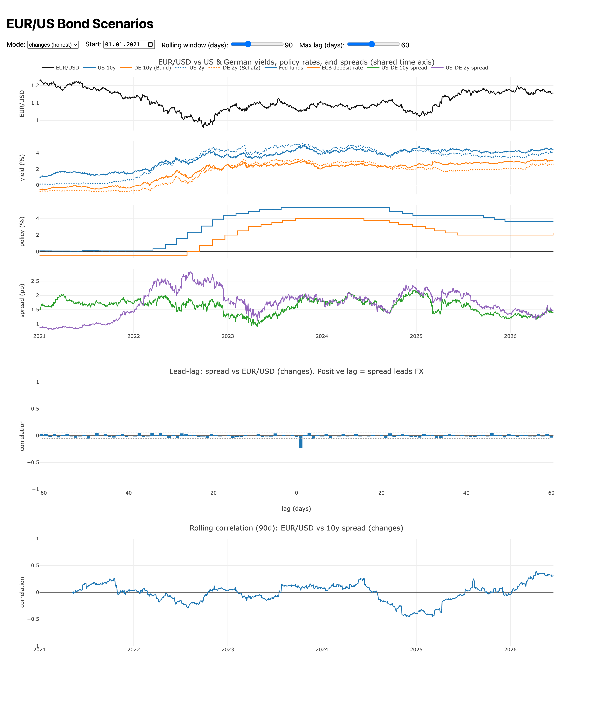

# EUR/US Bond Scenarios

Visualize **EUR/USD** against the things that move it — US & German bond yields, the
**Fed and ECB policy rates**, their spreads, plus the dollar index, Brent, and inflation —
and measure how they actually move together (correlation and lead-lag).

**Why it helps:** for a **euro-based (Germany/EU) investor**, this is a tool to analyze the
value of **US Treasuries**. An unhedged USD bond's *euro* return depends on both the Treasury
yield and the EUR/USD move, so the two have to be read together. Macro commentary keeps
claiming "the rate gap drives the euro" — this lets you *see* it in real data: overlay the
series on one timeline, and check whether the US–German yield spread actually **leads**
EUR/USD, and how that coupling shifts over time.

> Research / educational tool — **not financial advice.**



## Run

Requires [uv](https://docs.astral.sh/uv/) and Node.js 18+.

```bash
make data         # fetch real data (ECB, US Treasury, NY Fed, Yahoo, BLS) -> data/
make web-install  # install front-end deps
make dev          # open http://localhost:5173
```

No network for data? Use `make sample-data` instead of `make data` for a synthetic offline set.

## Tests

```bash
make test
```
